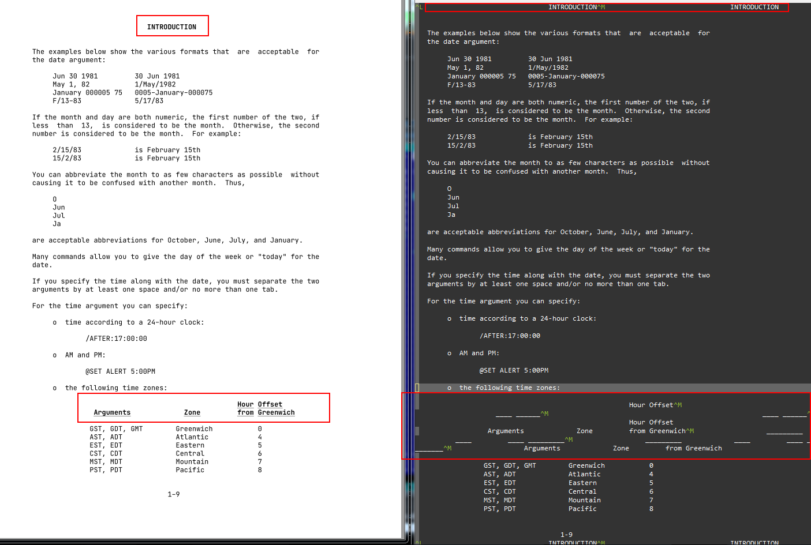

# MEM2TeX - Convert MEM Files PDF (using XeLaTeX)

* `MEM` files are created by the typesetting program `RUNOFF`
* `RNO` files are used as input for the RUNOFF formatter

`MEM` files are a simple ASCII text format which simulates
underlining and bold face with carriage return (without line feed)
and overprinting (see the screenshot which illustrates
the final document page on the left and the corresponding page in
a text editor right).

The [`perl`](https://www.perl.org/) script [MEM2TeX.pl](MEM2TeX.pl) simulates this overprinting
and generated `LaTeX` markup, from which `XeLaTeX` generates PDFs.



# Howto

## Prerequisites

* `perl`
  - On Windows I use [ActivePerl](https://www.activestate.com/products/perl/downloads/)
* A TeX distribution
  - On Windows I use [MiKTeX](https://miktex.org/howto/install-miktex)
* `JetBrains Mono` TrueType Fonts
  - Download `JetBrains Mono` TTFs from https://www.jetbrains.com/lp/mono/
    and 
  - unpack the zip `JetBrainsMono-2.001.zip`
  - move `JetBrainsMono-2.001\ttf\*` to `MEM2TeX\fonts\`

## Usage

```
# MEM2TeX.pl -?
Unknown option: ?
MEM2TeX.pl Version 1.7
Usage: MEM2TeX.pl ...
           --filename:  input file name
          [--pfi-file]: PDF file information file
          [--tex-file]: output XeLaTeX filename

Sample PDF file information file:
--------------------------------------------------
pdftitle={TOPS-20 LINK Reference Manual},
pdfauthor={Digital Equipment Corporation},
pdfsubject={TOPS-20 LINK},
pdfkeywords={AA-4183D-TM TOPS-20 LINK}
--------------------------------------------------
```

See [examples/](examples/) for some examples of usage and 
generated final pdf files.

